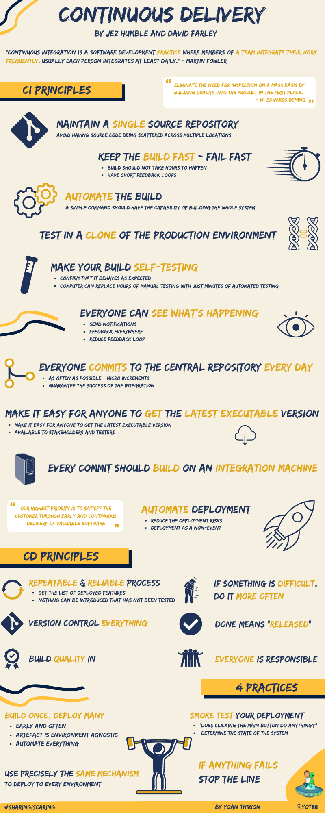
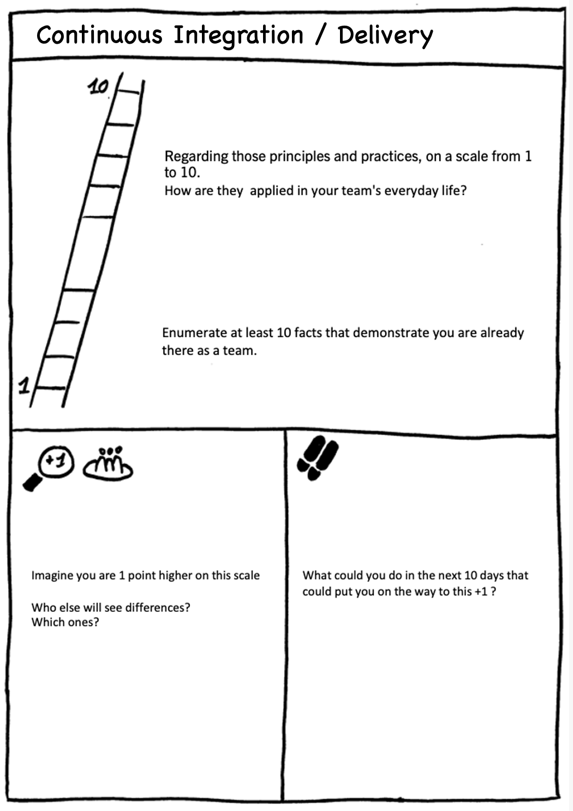

# Continuous Delivery Principles
## Learning Goals
- Understand truly what is `Continuous Delivery`
- Be able to apply `CI/CD` principles

## Connect - Where do we stand?
Individually, take a few minutes to analyze below principles:

Book infographic available in `pdf` [here](files/continuous-delivery.pdf)

## Concepts - Focus on the Unknown
Ask attendees, what needs to be explained and deep dive in...

## Concrete Practice - Solution Focus Ladder
Individually, feel the 3 parts of the ladder below:

### [1-2-4-All](https://www.liberatingstructures.com/1-1-2-4-all/)

Debrief in pairs, then in groups of 4, then all together.

## Conclusion - Choose 1
All, if you have to choose 1 stuff you want to remain from this part what would it be?

### Resources
Concepts from the book : [Continuous Delivery: Reliable Software Releases through Build, Test, and Deployment Automation](https://www.oreilly.com/library/view/continuous-delivery-reliable/9780321670250/) by David Farley and Jez Humble.